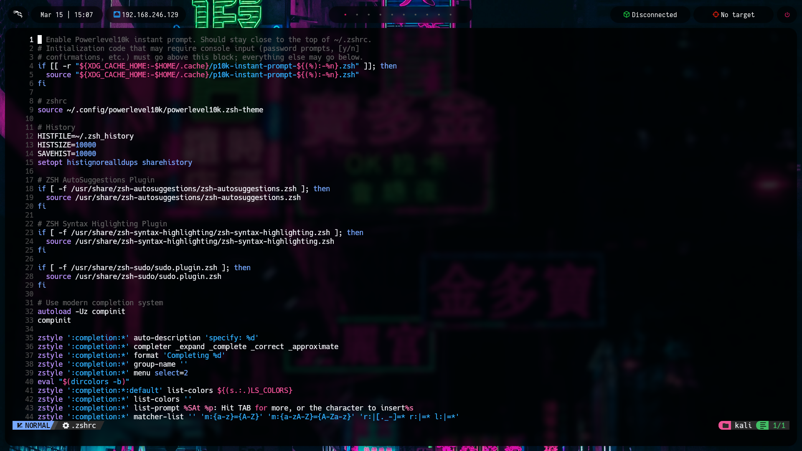

# Kali Linux Environment Auto Installer 📀

This project provides an automatic installation script to set up a **Kali Linux** environment based in [s4vitar environment](https://hack4u.io/cursos/personalizacion-de-entorno-en-linux/). 
The `install.sh` script installs all necessary tools and configurations for a complete Kali Linux setup.

## Preview

___

___

___

___


## Requirements

> This script is intended to be executed in a **Kali Linux** environment installed in a **Virtual Machine** with the official [**Kali Linux ISO**](https://www.kali.org/get-kali/#kali-installer-images).

Before running the installation script, make sure to execute:
```bash
sudo apt-get update && upgrade
```

## Installation Instructions

Follow the steps below to install the Kali Linux environment using the `install.sh` script:

1. **Clone the Repository**: First, clone this repository to your local machine.
   ```bash
   git clone https://github.com/eriic1002/kali-environment-autoinstaller.git
   cd kali-environment-autoinstaller
   ```

2. **Grant Execution Permissions**: You must grant execution permissions to the `install.sh` script:
   ```bash
   chmod +x install.sh
   ```

3. **Execute the installer**: You have to execute it as a **non-privileged user** ⚠️:
   ```bash
   ./install.sh
   ```

4. Provide your user's password to use commands with sudo.
5. Follow the installation steps.

## Tips
- **Customize the Installation**: You can customize the installation by commenting out the tools you don't want to install in the `install.sh` script or following the script step by step.

- **Picom bugs**: First try to enable "Accelerate 3D graphics" in Virtual Machine Settings. If you have problems with picom, you can try to change the configuration in the `~/.config/picom/picom.conf` file. Or you can delete the picom line of `~/.config/bspwm/bspswmrc` file.

- **Customize the wallpaper**: You can change the wallpaper before installation replacing the `wallpaper.jpg` file in the repository folder. Also, you can change the wallpaper after installation in the `~/.config/bspwm/bspwmrc` file.

## Tools Installed
- [**bspwm**](https://github.com/baskerville/bspwm): A tiling window manager.
- [**sxhkd**](https://github.com/baskerville/sxhkd): A hotkey daemon for bspwm.
- [**polybar**](https://github.com/polybar/polybar): A status bar.
- [**rofi**](https://github.com/davatorium/rofi): A window switcher, application launcher, and dmenu replacement.
- [**picom**](https://github.com/yshui/picom): A compositor for X11.
- [**kitty**](https://github.com/kovidgoyal/kitty): A modern, hackable, featureful, GPU-based terminal emulator.
- [**Neovim**](https://github.com/neovim/neovim): A highly configurable text editor.
- [**zsh**](https://github.com/zsh-users/zsh): A shell designed for interactive use.
- [**zsh-autosuggestions**](https://github.com/zsh-users/zsh-autosuggestions): Fish-like autosuggestions for zsh.
- [**zsh-syntax-highlighting**](https://github.com/zsh-users/zsh-syntax-highlighting): Fish shell like syntax highlighting for Zsh.
- [**zsh-sudo**](https://github.com/ohmyzsh/ohmyzsh/blob/master/plugins/sudo/sudo.plugin.zsh): A Zsh plugin to insert sudo into commands quickly and easily
- [**powerlevel10k**](https://github.com/romkatv/powerlevel10k): A theme for Zsh.
- [**fzf**](https://github.com/junegunn/fzf): A command-line fuzzy finder.
- [**bat**](https://github.com/sharkdp/bat): A cat clone with better syntax highlighting.
- [**lsd**](https://github.com/lsd-rs/lsd): A ls with a lot of pretty colors.
- [**Hack Nerd fonts**](https://www.nerdfonts.com/font-downloads): A font patched with Nerd fonts.

## ZSH Custom functions
There are a custom function in the `~/.zshrc` file that you can use to change the target ip of the `polybar`:
```bash
function set_target(){
	ip_address=$1
	echo "$ip_address" > ~/.config/bspwm/scripts/target_ip
}
```
For see more useful custom functions, you can check the `~/.zshrc` file.


## Contact
For questions, issues, or suggestions, please open an **issue** in the repository. 

## Information
**Disclaimer**: This script is provided "as is" without any warranty. Use it at your own risk. Fully tested it in VMWare workstation and Virtualbox.
